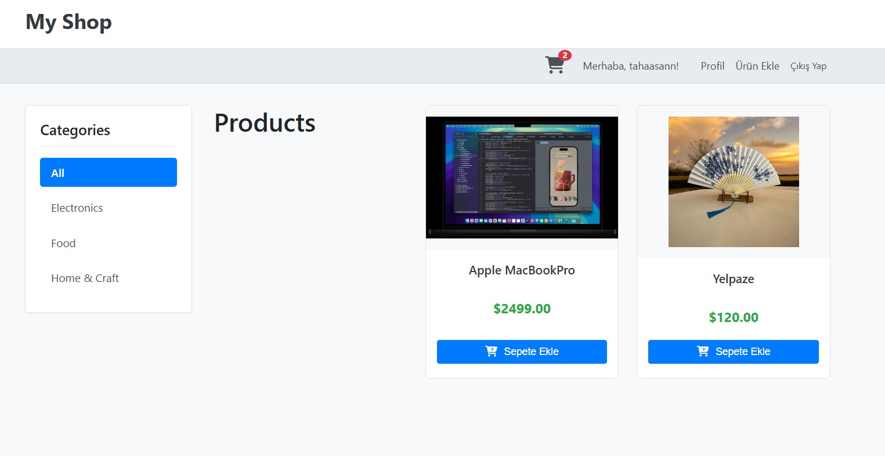
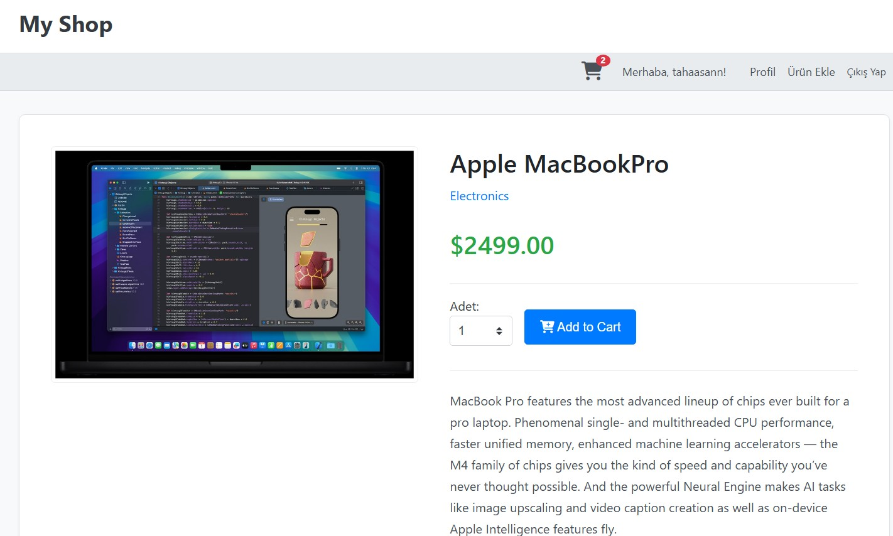
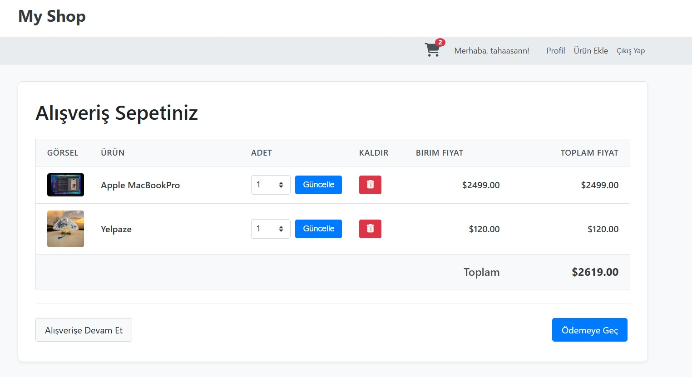

# My Shop - Django E-Ticaret Projesi

  

100 Günlük Python Bootcamp kapsamında geliştirilen basit bir e-ticaret web uygulamasıdır. Bu proje, Django çatısının temel özelliklerini (Modeller, View'lar, Şablonlar, Formlar, ORM, Kimlik Doğrulama, Admin Paneli, Statik/Medya Dosya Yönetimi, Session Yönetimi) pratik etmek amacıyla oluşturulmuştur.

## ✨ Temel Özellikler

*   **Ürün Yönetimi:**
    *   Kategorilere göre ürün listeleme.
    *   Ürün detay sayfası görüntüleme.
    *   Giriş yapan kullanıcıların ürün eklemesi (isim, kategori, açıklama, fiyat, resim).
    *   Kullanıcıların sadece kendi eklediği ürünleri düzenlemesi ve silmesi.
    *   Django Admin paneli üzerinden tam ürün ve kategori yönetimi.
*   **Kullanıcı Yönetimi:**
    *   Kullanıcı kaydı (Signup).
    *   Kullanıcı girişi (Login) ve çıkışı (Logout).
    *   Basit kullanıcı profili sayfası.
    *   Şifre sıfırlama (Django'nun hazır sistemi üzerinden).
*   **Alışveriş Sepeti:**
    *   Session tabanlı alışveriş sepeti (Kullanıcı girişi gerektirmez).
    *   Ürünleri sepete ekleme (adet belirterek).
    *   Sepet içeriğini görüntüleme.
    *   Sepetteki ürün adetini güncelleme.
    *   Ürünleri sepetten kaldırma.
    *   Toplam sepet tutarını görme.
*   **Arayüz:**
    *   Temel, temiz ve responsive (mobil uyumlu) arayüz.
    *   Font Awesome ikonları.
    *   Django Messages Framework ile kullanıcı geri bildirimleri.

## 📸 Ekran Görüntüleri

*(Buraya uygulamanızın birkaç ekran görüntüsünü ekleyin. Örn: Anasayfa, Ürün Detayı, Sepet, Giriş Sayfası)*

| Anasayfa                                       | Ürün Detay                                     | Sepet                                       |
| :--------------------------------------------: | :--------------------------------------------: | :-----------------------------------------: |
|  |  |  |

## 🛠️ Kullanılan Teknolojiler

*   **Backend:** Python, Django
*   **Veritabanı:** SQLite (varsayılan, kolayca PostgreSQL vb. ile değiştirilebilir)
*   **Frontend:** HTML5, CSS3 (Özel CSS), Font Awesome (İkonlar)
*   **Python Kütüphaneleri:** Pillow (Resim işleme için)

## 🚀 Kurulum ve Çalıştırma

Projeyi local makinenizde çalıştırmak için aşağıdaki adımları izleyin:

1.  **Projeyi Klonlayın:**
    ```bash
    git clone https://github.com/tahaasann/django_ecommerce_app.git
    cd django_ecommerce_app
    ```

2.  **Sanal Ortam Oluşturun ve Aktive Edin:**
    ```bash
    # Windows
    python -m venv venv
    .\venv\Scripts\activate

    # macOS / Linux
    python3 -m venv venv
    source venv/bin/activate
    ```

3.  **Gerekli Kütüphaneleri Yükleyin:**
    *(Proje kök dizininde olduğunuzdan emin olun)*
    ```bash
    pip install -r requirements.txt
    ```
    *   **Not:** Eğer `requirements.txt` dosyanız yoksa, sanal ortam aktifken şu komutla oluşturun: `pip freeze > requirements.txt` ve bu dosyayı da Git'e ekleyin.

4.  **Veritabanı Migration'larını Uygulayın:**
    ```bash
    python manage.py migrate
    ```

5.  **Bir Süper Kullanıcı (Admin) Oluşturun:**
    ```bash
    python manage.py createsuperuser
    ```
    *(İstenecek kullanıcı adı, email ve şifreyi girin)*

6.  **(Opsiyonel) Ortam Değişkenleri:**
    Eğer `settings.py` dosyasında `SECRET_KEY`, veritabanı bilgileri gibi hassas verileri dışarıdan alıyorsanız (örneğin `.env` dosyası veya sistem ortam değişkenleri ile), bu değişkenleri ayarladığınızdan emin olun. **`.env` dosyasını `.gitignore` ile repo dışında tutun!**

7.  **Geliştirme Sunucusunu Başlatın:**
    ```bash
    python manage.py runserver
    ```

8.  Tarayıcınızda `http://127.0.0.1:8000/` adresine gidin. Admin paneline erişmek için `http://127.0.0.1:8000/admin/` adresini kullanabilirsiniz.

## 📖 Kullanım

*   Ana sayfada ve kategori sayfalarında ürünleri gezinin.
*   Ürün detaylarını görmek için bir ürüne tıklayın.
*   "Sepete Ekle" butonu ile ürünleri sepetinize ekleyin.
*   Sağ üstteki sepet ikonuna tıklayarak sepetinizi görüntüleyin ve düzenleyin.
*   Yeni kullanıcı oluşturmak için "Kayıt Ol" linkini kullanın.
*   Hesabınıza erişmek için "Giriş Yap" linkini kullanın.
*   Giriş yaptıktan sonra "Ürün Ekle" linki ile yeni ürünler ekleyebilirsiniz.
*   Kendi eklediğiniz ürünlerin detay sayfasında "Düzenle" ve "Sil" butonları görünecektir.

## 🏗️ Proje Yapısı

```plaintext
my_shop_project/
├── .git/                     # Git sürüm kontrolü (genellikle gizli)
├── .gitignore                # Git'in yok sayacağı dosyalar
├── README.md                 # Bu dosya
├── requirements.txt          # Gerekli Python kütüphaneleri
├── manage.py                 # Django yönetim komutları
├── venv/                     # Sanal ortam (gitignore'da)
├── db.sqlite3                # Veritabanı dosyası (gitignore'da)
│
├── my_shop/                  # Django Proje Konfigürasyon Dizini
│   ├── __init__.py
│   ├── asgi.py
│   ├── settings.py           # Proje Ayarları
│   ├── urls.py               # Ana URL Yönlendirmeleri
│   └── wsgi.py
│
├── products/                 # Ürünler Uygulaması (App)
│   ├── __init__.py
│   ├── admin.py              # Admin paneli kayıtları
│   ├── apps.py
│   ├── forms.py              # Ürün ekleme/düzenleme formu
│   ├── migrations/           # Veritabanı geçişleri
│   │   └── ...
│   ├── models.py             # Category, Product modelleri
│   ├── templates/            # Uygulamaya özel şablonlar
│   │   └── products/
│   │       ├── add_edit_product.html
│   │       └── product/
│   │           ├── detail.html
│   │           └── list.html
│   ├── urls.py               # Uygulama URL yönlendirmeleri
│   └── views.py              # Uygulama view fonksiyonları
│
├── accounts/                 # Kullanıcı Hesapları Uygulaması (App)
│   ├── __init__.py
│   ├── admin.py
│   ├── apps.py
│   ├── migrations/
│   │   └── ...
│   ├── models.py             # (Şu an için boş olabilir)
│   ├── templates/
│   │   └── accounts/
│   │       ├── profile.html
│   │       └── signup.html
│   ├── urls.py
│   └── views.py
│
├── cart/                     # Alışveriş Sepeti Uygulaması (App)
│   ├── __init__.py
│   ├── admin.py
│   ├── apps.py
│   ├── cart.py               # Sepet mantığı sınıfı
│   ├── context_processors.py # Sepeti global yapma
│   ├── forms.py              # Sepete ekleme formu
│   ├── migrations/
│   │   └── ...
│   ├── models.py             # (Şu an için boş olabilir)
│   ├── templates/
│   │   └── cart/
│   │       └── detail.html
│   ├── urls.py
│   └── views.py
│
├── templates/                # Proje Geneli Şablonlar
│   ├── base.html             # Ana şablon
│   └── registration/         # Django Auth şablonları
│       ├── login.html
│       ├── logged_out.html
│       └── ... (password_reset vb.)
│
├── static/                   # Proje Geneli Statik Dosyalar (CSS, JS, Resimler)
│   ├── css/
│   │   └── base.css
│   ├── img/
│   │   └── no_image.png
│   └── js/
│       └── (varsa .js dosyaları)
│
└── media/                    # Kullanıcı Tarafından Yüklenen Medya (gitignore'da)
    └── products/             # Ürün resimlerinin yüklendiği yer
        └── ...


## 🔮 Gelecek İyileştirmeler (Fikirler)

*   Sipariş yönetimi sistemi eklemek.
*   Ödeme sistemi entegrasyonu (Stripe, PayPal vb.).
*   Ürün arama fonksiyonu.
*   Ürün puanlama ve yorum sistemi.
*   Kullanıcı profiline daha fazla detay eklemek (adres vb.).
*   Asenkron işlemler için Celery/Redis kullanımı (örn: email gönderimi).
*   Daha gelişmiş bir frontend için JavaScript framework (Vue.js, React) entegrasyonu (DRF ile).
*   Testler yazmak (Unit/Integration Tests).

## 📜 Lisans

Bu proje MIT Lisansı altında lisanslanmıştır. 

## 📫 İletişim

Taha ASAN - tahaasann@gmail.com

Proje Linki: [https://github.com/tahaasann/django_ecommerce_app](https://github.com/tahaasann/django_ecommerce_app)

